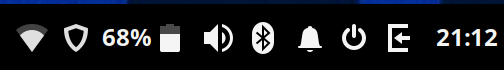
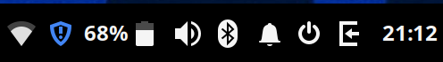

# budgie-ufw-applet

This applet indicates in the Budgie Desktop panel if UFW is enabled or disabled.

**Enabled:**



**Disabled:**




## Manual installation

1. Install applet on your machine:
```
$ cd .local/share/budgie-desktop/plugins/
$ git clone https://github.com/maveonair/budgie-ufw-applet.git
```
2. Add the applet to any of your panel in the Budgie Desktop Settings
